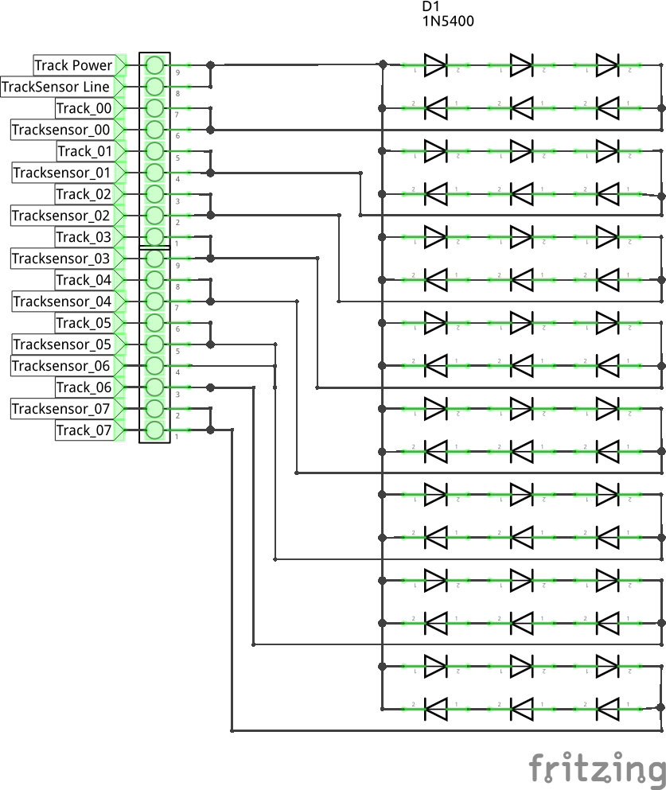
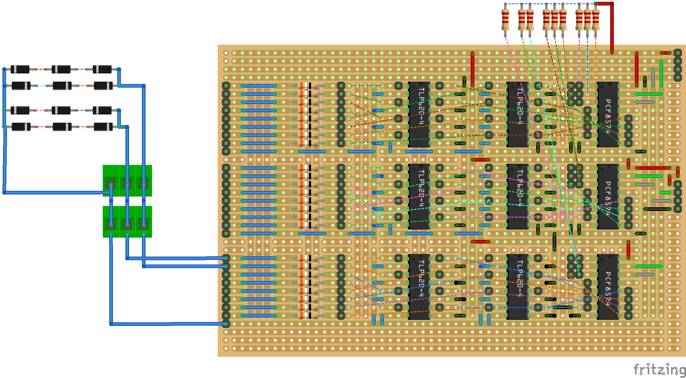
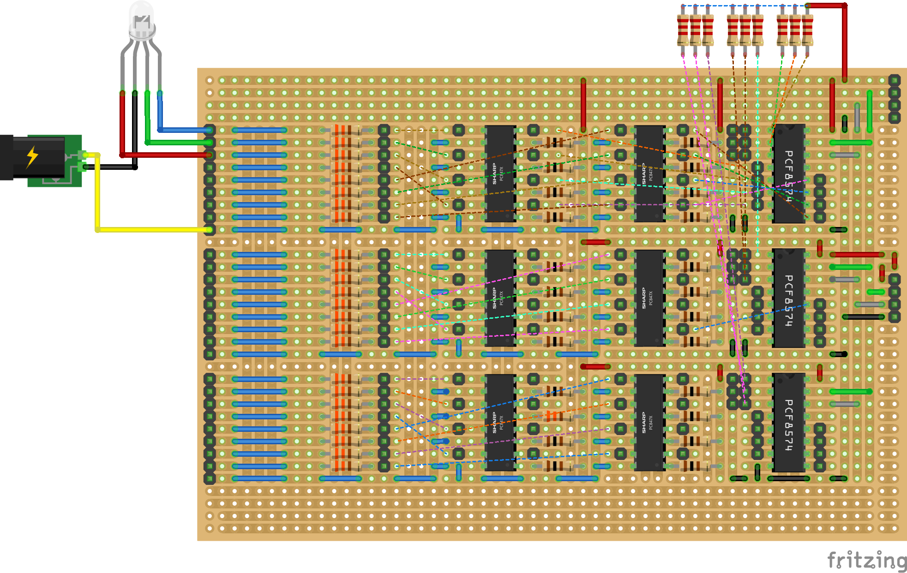

# OMJK version af HA styring

## PCB-CPU & Power

|Schematic|
|:---:|
||

|PCB|
|:---:|
||

### CPU & Power Files

* Fritzing
  * [Fritzing CPU-File](./Fritzing/PCB-CPU/PCB-CPU_and_Power.fzz)
* ESPHome yaml]
  * [CPU with TrackSensor]()

### CPU & Power Matrialer

* IC 
  * [ESP32 DEV KIT DOIT Udviklingsboard](https://ebits.dk/products/esp32-dev-kit-doit-udviklingsboard?_pos=2&_sid=e219da91c&_ss=r "ebits.dk")
  * [I2C Expander - TCA9548A](https://arduinotech.dk/shop/8-channel-i2c-muti-channel-expansion-development-board/ "Arduino Tech.dk")
  * [Step Down 4.5-24 DC-DC 3A 0.8-17V Module Adjustable](https://ardustore.dk/produkt/step-down-4-5-24-dc-dc-3a-0-8-17v-module-adjustable "ardustore.dk")
* Connector
  * Pin Header Male
    * 1 stk. [Pin Header Male Single Row 1×40](https://ardustore.dk/produkt/pin-header-male-single-row-1x40 "ardustore.dk")
  * Dupont Jumper Wire Male
    * 1 stk. [10stk. Dupont Jumper Wire 1p 10cm Hun-Hun](https://arduinotech.dk/shop/dupont-jumper-wire-1p-10cm/  "Arduino Tech.dk")
    * Dupont Connector Housing
    * 7 stk. [2 pol Dupont Connector Housing](https://arduinotech.dk/shop/dupont-stik-1p-10p-diy/)
    * 1 stk. [4 pol Dupont Connector Housing](https://arduinotech.dk/shop/dupont-stik-1p-10p-diy/)
    * 2 stk. [6 pol Dupont Connector Housing](https://arduinotech.dk/shop/dupont-stik-1p-10p-diy/)
  * PINRÆKKE M.FLIG VINKEL MOD 2.54 5556
    * 1 stk. [2PL. PINRÆKKE M.FLIG VINKEL MOD 2.54 (vnr: 5556.02A)](https://el-supply.dk/2pl-pinraekke-mflig-vinkel-mod-254/varenummer/0-5556.02A "el-supply.dk")
    * 6 stk. [4PL. PINRÆKKE M.FLIG VINKEL MOD 2.54 (vnr: 5556.04A)](https://el-supply.dk/4pl-pinraekke-mflig-vinkel-mod-254/varenummer/0-5556.04A "el-supply.dk")
  * LØS CRIMPHUS med LÅS
    * 1 stk. [LØS CRIMPHUS med LÅS 2PL MOD 2.54 (vnr: 5557.02)](https://el-supply.dk/loes-crimphus-med-laas-2pl-mod-254/varenummer/0-5557.02 "el-supply.dk")
    * 6 stk. [LØS CRIMPHUS med LÅS 4PL MOD 2.54 (vnr: 5557.04)](https://el-supply.dk/loes-crimphus-med-laas-6pl-mod-254/varenummer/0-5557.04 "el-supply.dk")
  * LEDNING MED CRIMPTERMINAL 5594
    * 7 stk. [LEDNING MED CRIMPTERMINAL 30cm SORT (vnr: 5594.0)](https://el-supply.dk/ledning-med-crimpterminal-30cm-sort/varenummer/0-5594.0 "el-supply.dk")
    * 6 stk. [LEDNING MED CRIMPTERMINAL 30cm RØD (vnr: 5594.2)](https://el-supply.dk/ledning-med-crimpterminal-30cm-roed/varenummer/0-5594.2 "el-supply.dk")
    * 1 stk. [LEDNING MED CRIMPTERMINAL 30cm GUL (vnr: 5594.4)](https://el-supply.dk/ledning-med-crimpterminal-30cm-gul/varenummer/0-5594.4 "el-supply.dk")
* PCB
  * [Rademacher WR-Typ 941 Printplade](https://www.conradelektronik.dk/p/rademacher-wr-typ-941-europrintplade-epoxyd-l-x-b-160-mm-x-100-mm-35-m-rastermal-254-mm-indhold-1-stk-529568 "conradelektronik.dk")

## PCB-TrackInterface

|Schematic|
|:---:|
||

### TrackInterface Files

* [Fritzing TrackSensor-File](./Fritzing/PCB-TrackInterface/TrackInterface.fzz)

### TrackInterface Matrialer

* Dioder
  * 64 stk. [1N5400 ENSRETTERDIODE 50V/3A DO201 (vnr: 251N5400)](https://el-supply.dk/soeg/?s=1n5400 "el-supply.dk")
* SKRUETERMINAL
  * 9 stk. [SKRUETERMINAL FOR PRINT 2PL 5.08mm](https://el-supply.dk/skrueterminal-for-print-2pl-508mm/varenummer/624-5512/2 "el-supply.dk")
* PCB
  * 1 stk. [Rademacher WR-Typ 821 Hulprint 5.08 mm](https://www.conradelektronik.dk/p/rademacher-wr-typ-821-printplade-hardt-papir-l-x-b-160-mm-x-100-mm-35-m-rastermal-508-mm-indhold-1-stk-527232 "conradelektronik.dk")

## PCB-TrackSensor

|Schematic|
|:---:|
||

|PCB|
|:---:|
||

### TrackSensor Files

* [Fritzing TrackSensor-File](./Fritzing/PCB-TrackSensor/PCB-TrackSensor.fzz)

### TrackSensor Matrialer

* IC
  * 3 stk. [PCF8574P](https://softgenie.dk/ic/946-pcf8574.html "softgenie.dk")
* Optocopler
  * 6 stk. [TLP620-4 OPTOKOBLER 55V 50mA 5kV DIL16 (vnr: 386TLP620-4)](https://el-supply.dk/tlp620-4-optokobler-55v-50ma-5kv-dil16/varenummer/0-386TLP620-4 "el-supply.dk")
* Modstande
  * 3 stk. [MODSTANDSNETVÆRK SIL 4P 3x2K2 (vnr: 10F4422)](https://el-supply.dk/modstandsnetvaerk-sil-4p-3x2k2/varenummer/71-10F4422 "el-supply.dk")
  * 24 stk. [100 OHM KULMODSTAND (vnr: 041310)]( https://el-supply.dk/100-stk-100-ohm-kulmodstand/varenummer/0-041310 "el-supply.dk")
* Connector
  * Pin Header Male
    * 3 stk. [Pin Header Male Single Row 1×40](https://ardustore.dk/produkt/pin-header-male-single-row-1x40 "ardustore.dk")
  * Dupont Jumper Wire Male
    * 6 stk. [10stk. Dupont Jumper Wire 1p 10cm Hun-Hun](https://arduinotech.dk/shop/dupont-jumper-wire-1p-10cm/  "Arduino Tech.dk")
    * Dupont Connector Housing
    * 6 stk. [4 pol Dupont Connector Housing](https://arduinotech.dk/shop/dupont-stik-1p-10p-diy/)
    * 15 stk. [8 pol Dupont Connector Housing](https://arduinotech.dk/shop/dupont-stik-1p-10p-diy/)
  * PINRÆKKE M.FLIG VINKEL MOD 2.54 5556
    * 2 stk. [4PL. PINRÆKKE M.FLIG VINKEL MOD 2.54 (vnr: 5556.04A)](https://el-supply.dk/4pl-pinraekke-mflig-vinkel-mod-254/varenummer/0-5556.04A "el-supply.dk")
    * 3 stk. [10PL. PINRÆKKE M.FLIG VINKEL MOD 2.54 (vnr: 5556.10A)](https://el-supply.dk/4pl-pinraekke-mflig-vinkel-mod-254/varenummer/0-5556.10A "el-supply.dk")
  * LØS CRIMPHUS med LÅS
    * 2 stk. [LØS CRIMPHUS med LÅS 4PL MOD 2.54 (vnr: 5557.04)](https://el-supply.dk/loes-crimphus-med-laas-6pl-mod-254/varenummer/0-5557.04 "el-supply.dk")
    * 3 stk. [LØS CRIMPHUS med LÅS 10PL MOD 2.54](https://el-supply.dk/loes-crimphus-med-laas-10pl-mod-254/varenummer/0-5557.10 "el-supply.dk")
* PCB
  * [Rademacher WR-Typ 941 Printplade](https://www.conradelektronik.dk/p/rademacher-wr-typ-941-europrintplade-epoxyd-l-x-b-160-mm-x-100-mm-35-m-rastermal-254-mm-indhold-1-stk-529568 "conradelektronik.dk")

## PCB-PCB-LedDriver

|Schematic|
|:---:|
||

|PCB|
|:---:|
||

### LedDriver Files

* [Fritzing LedDriver-File](./Fritzing/PCB-LedDriver/PCB-LedDriver.fzz)

### LedDriver Matrialer

* IC
  * 3 stk. [PCF8574P](https://softgenie.dk/ic/946-pcf8574.html "softgenie.dk")
* Optocopler
  * 6 stk. [PC847](https://softgenie.dk/ic/302-pc817-opto-coubler.html "softgenie.dk")
* Modstande
  * 3 stk. [MODSTANDSNETVÆRK SIL 4P 3x2K2 (vnr: 10F4422)](https://el-supply.dk/modstandsnetvaerk-sil-4p-3x2k2/varenummer/71-10F4422 "el-supply.dk")
  * 24 stk. [100 OHM KULMODSTAND (vnr: 041310)]( https://el-supply.dk/100-stk-100-ohm-kulmodstand/varenummer/0-041310 "el-supply.dk")
  * 24 stk. [100 stk. 330 OHM KULMODSTAND(vnr: 041333)](https://el-supply.dk/100-stk-330-ohm-kulmodstand/varenummer/0-041333 "el-supply.dk")
* Connector
  * Pin Header Male
    * 3 stk. [Pin Header Male Single Row 1×40](https://ardustore.dk/produkt/pin-header-male-single-row-1x40 "ardustore.dk")
  * Dupont Jumper Wire Male
    * 6 stk. [10stk. Dupont Jumper Wire 1p 10cm Hun-Hun](https://arduinotech.dk/shop/dupont-jumper-wire-1p-10cm/  "Arduino Tech.dk")
    * Dupont Connector Housing
    * 6 stk. [4 pol Dupont Connector Housing](https://arduinotech.dk/shop/dupont-stik-1p-10p-diy/)
    * 15 stk. [8 pol Dupont Connector Housing](https://arduinotech.dk/shop/dupont-stik-1p-10p-diy/)
  * PINRÆKKE M.FLIG VINKEL MOD 2.54 5556
    * 2 stk. [4PL. PINRÆKKE M.FLIG VINKEL MOD 2.54 (vnr: 5556.04A)](https://el-supply.dk/4pl-pinraekke-mflig-vinkel-mod-254/varenummer/0-5556.04A "el-supply.dk")
    * 3 stk. [10PL. PINRÆKKE M.FLIG VINKEL MOD 2.54 (vnr: 5556.10A)](https://el-supply.dk/4pl-pinraekke-mflig-vinkel-mod-254/varenummer/0-5556.10A "el-supply.dk")
  * LØS CRIMPHUS med LÅS
    * 2 stk. [LØS CRIMPHUS med LÅS 4PL MOD 2.54 (vnr: 5557.04)](https://el-supply.dk/loes-crimphus-med-laas-6pl-mod-254/varenummer/0-5557.04 "el-supply.dk")
    * 3 stk. [LØS CRIMPHUS med LÅS 10PL MOD 2.54](https://el-supply.dk/loes-crimphus-med-laas-10pl-mod-254/varenummer/0-5557.10 "el-supply.dk")
* PCB
  * [Rademacher WR-Typ 941 Printplade](https://www.conradelektronik.dk/p/rademacher-wr-typ-941-europrintplade-epoxyd-l-x-b-160-mm-x-100-mm-35-m-rastermal-254-mm-indhold-1-stk-529568 "conradelektronik.dk")

<hr>

## Home Assistant

### Lovelace

|Track||
|:---:|:---:|
|||

### Lovelace yaml

Track 001.000-007:

```yaml
type: entities
entities:
  - entity: sensor.futtog_001_futtog_001_ip_address
  - entity: binary_sensor.futtog_001_track_000
  - entity: binary_sensor.futtog_001_track_001
  - entity: binary_sensor.futtog_001_track_002
  - entity: binary_sensor.futtog_001_track_003
  - entity: binary_sensor.futtog_001_track_004
  - entity: binary_sensor.futtog_001_track_005
  - entity: binary_sensor.futtog_001_track_006
  - entity: binary_sensor.futtog_001_track_007
title: Track 001.000-007
state_color: true

```

Track 001.100-107:

```yaml
type: entities
entities:
  - entity: sensor.futtog_001_futtog_001_ip_address
  - entity: binary_sensor.futtog_001_track_100
  - entity: binary_sensor.futtog_001_track_101
  - entity: binary_sensor.futtog_001_track_102
  - entity: binary_sensor.futtog_001_track_103
  - entity: binary_sensor.futtog_001_track_104
  - entity: binary_sensor.futtog_001_track_105
  - entity: binary_sensor.futtog_001_track_106
  - entity: binary_sensor.futtog_001_track_107
title: Track 001.100-107
state_color: true

```