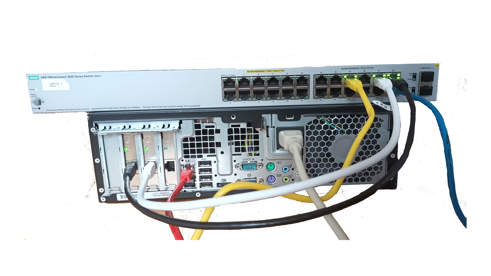

# OPNsense & HPE OfficeConnect Switch 1820 24G PoE+

.png)

## Network Diagram

|Home Assistant|OPNsense & Switch|WiFiExtender for WAN|||
|:---:|:---:|:---:|:---:|:---:|
|||_normal_1547804734225p.jpg)|

## Cable conection

|EthCabel|Function|OPNsense|Switch|HomeAssistant|WiFiExtender for WAN|ManagerPC|
|:---:|:---:|:---:|:---:|:---:|:---:|:---:|
|Red|WAN|(em0)|||Eth||
|Black|LAN (vlan1)|(re0)|Port23|
|White|VLANs (vlan 10,12,30)|(re1)|Port21|
|Yellow|Home Assistant Server|||Eth||
|Blue|Manegent PC||Port24|||Eth|

## Sources and inspiration

* OPNsense documentation & wiki project
  * [Introduction](https://docs.opnsense.org/intro.html)
* Home Network Guy Articles:
  * [Set Up a Fully Functioning Home Network Using OPNsense](https://homenetworkguy.com/how-to/set-up-a-fully-functioning-home-network-using-opnsense/ "Home Network Guy")
* [Home Network Guy Videos:](https://www.youtube.com/playlist?ist=PLZeTcCOrKlnDlyZCIxhFZukAnA0NNWL_I "Home Network Guy")
  * [Set up a Full Network using OPNsense (Part 1: Overview)](https://youtu.be/54JWsGedXpo?list=PLZeTcCOrKlnDlyZCIxhFZukAnA0NNWL_I "Home Network Guy")
  * [Set up a Full Network using OPNsense (Part 2: OPNsense)](https://youtu.be/h2_cQxTkh3Q?list=PLZeTcCOrKlnDlyZCIxhFZukAnA0NNWL_I "Home Network Guy")
  * [Set up a Full Network using OPNsense (Part 3: Switch)](https://youtu.be/4HP-YAJX56E?list=PLZeTcCOrKlnDlyZCIxhFZukAnA0NNWL_I "Home Network Guy")
  * [Set up a Full Network using OPNsense (Part 4: Wireless Access Point)](https://youtu.be/xiugRYzO3lQ?list=PLZeTcCOrKlnDlyZCIxhFZukAnA0NNWL_I "Home Network Guy"))

## Setup & configurations instructions

* Switch
  * [HPE OfficeConnect Switch 1820 24G PoE+ Configuration](./10-HPE-1820.md)
* OPNsense
  * [Install from USB-key](./20-Install-OPNsense.md)
  * [Interface](./30-Interface-OPNsense.md)
  * [Service > DHCPv4](./40-Services-OPNsense.md)
  * [Firewall](./50-Firewall-OPNsense.md)
  